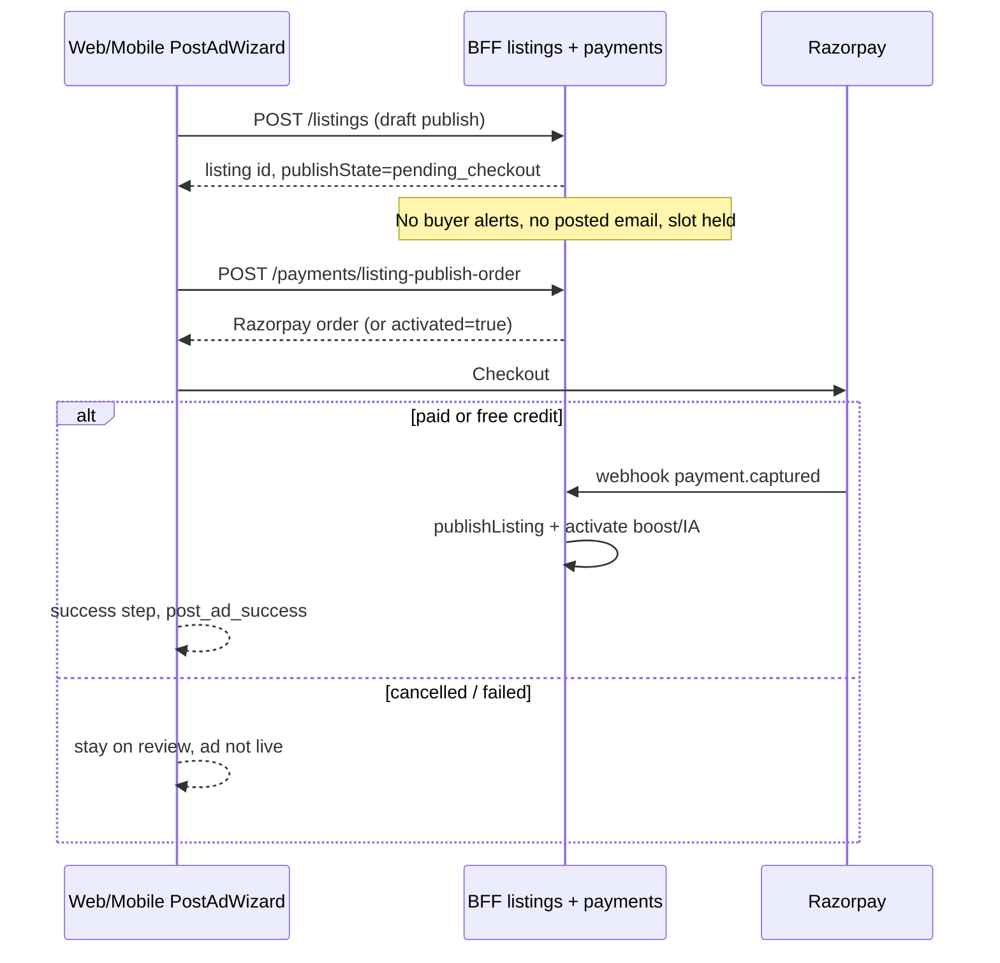

# Platform fee (admin) + checkout gate when paid add-ons are selected

## Status: implemented (2026-09-23) — Phase 1

Supersedes the **accepted failure mode** in
[`boost-instant-alerts-preview-selector.md`](boost-instant-alerts-preview-selector.md) §“Why the
money still moves after the listing exists” / “Failed/cancelled payment”: when the advertiser has
chosen **Boost and/or Instant Alerts**, or when a **mandatory platform fee** is in effect, a failed
or cancelled payment must **not** result in a live posted ad.

Related: [`monetization-boosted-listings-premium-tiers.md`](monetization-boosted-listings-premium-tiers.md),
[`product-pricing-tiers.md`](product-pricing-tiers.md), implemented preview-step selector
[`boost-instant-alerts-preview-selector.md`](boost-instant-alerts-preview-selector.md).

---

## Goals

1. **Checkout gate** — If the advertiser selected Boost and/or Instant Alerts, the ad must **not
   go live** (and must not be treated as “posted”) unless checkout for those selections succeeds
   (or activates via an existing free-credit short-circuit).
2. **Admin-configurable platform fee** — Per category tier (same three tiers as boost). When the
   configured fee for that listing’s category is **> ₹0**, the platform fee is **mandatory** on every
   publish checkout. When admin sets a tier to **₹0**, that fee is **not added** (no line item, not
   charged, not shown). **Boost** is optional; **Instant Alerts** is optional only as an add-on to a
   selected Boost (Boost alone, or Boost + Instant Alerts — not IA without Boost on this flow).
3. **Both offer placements** — Platform fee + optional Boost/IA UI and checkout behavior must work
   whether the admin shows the picker on the **Preview/review step** (`showSelectorOnPreview`) or
   on the **post-ad success upsell** (today’s default).
4. **Web + mobile** — Same rules and pricing on `apps/web` and `apps/mobile`, preserving iOS App
   Store payment constraints (external website checkout only for digital goods).

---

## Product rules (canonical)

| Setting / choice | Required to publish? | If payment fails or checkout dismissed |
|------------------|----------------------|----------------------------------------|
| Platform fee (`platformFeeFor(category) > 0`) | Yes — always in checkout | Ad does **not** go live |
| Platform fee (admin set **₹0** for this category tier) | Not applied | N/A |
| Boost (7d / 15d) | Only if selected | Ad does **not** go live |
| Instant Alerts | Only if selected **with** a Boost | Ad does **not** go live |
| Fee ₹0 for category + boost/IA skipped | No paid checkout | Today’s free post (unchanged) |

**Checkout cart shapes** (valid combinations):

- Fee only — mandatory fee, user skipped Boost (`Skip / No boost`).
- Fee + Boost — fee plus chosen 7d/15d boost, Instant Alerts off.
- Fee + Boost + Instant Alerts — fee plus bundled boost/IA (same pricing as today’s bundle).

There is no “Instant Alerts only” line on the publish checkout; standalone IA remains the existing
post-live upsell path when applicable.

**Mutually exclusive UI placement** (unchanged): `BoostPriceSetting.showSelectorOnPreview` still
decides Preview-step vs post-success upsell for the **Boost/IA picker**, not whether the platform
fee row appears — when `platformFeeFor(category) > 0`, the fee row shows on **review** (and in
totals anywhere the publish options block renders), regardless of boost placement.

**Default Boost/IA selection** (today: 15-day + Instant Alerts pre-filled on Preview when the
selector is shown): keep for merchandising, but “Skip / No boost” must remain explicit. When fee
applies and Boost is skipped, checkout is **fee-only**.

---

## Current behavior (gap)

1. `ListingsService.create()` always creates an **active** listing, fires buyer alerts, sends
   “your ad is live” notifications, consumes a slot, and reports `post_ad_success` conversions
   — **before** any Boost/IA Razorpay sheet runs (`PostAdWizard` → `createListingAction` → then
   `startBoostCheckout`).
2. Boost/IA orders **require** an existing `listingId` (`PaymentsService.createBoostOrder` /
   `createInstantAlertsOrder`).
3. Cancelled/failed Boost checkout leaves the listing **posted but un-boosted** (documented as
   intentional in the preview-selector plan).

There is **no** platform fee model, admin surface, or `PaymentPurpose` for listing publication
today.

---

## Proposed architecture: “create draft → pay → publish”

Keep listing-scoped payments (no greenfield “pay before listing id exists”), but split **persistence**
from **go-live**:



### Listing publish state

Add a server-owned gate — prefer **explicit fields** over overloading `ListingStatus`:

```prisma
enum ListingPublishState {
  live              // default for rows created before migration + normal free posts
  pending_checkout  // created, media uploaded, not browsable, side effects deferred
  checkout_failed   // optional: last attempt failed; still not live (see cleanup)
}

model Listing {
  // ...
  publishState ListingPublishState @default(live)
  /// Set when publishState becomes live — drives “when did this ad actually go live?”
  publishedAt  DateTime?
}
```

**Browse / SEO / My listings**: all public and owner list queries that today filter `status:
active` must also require `publishState: live` (and existing expiry rules). Detail pages for
`pending_checkout` return 404 to non-owners; owners see a “Complete payment to publish” state.

**Slot cap**: `ListingSlotsService.assertCanPublish` should treat `pending_checkout` listings
owned by the user as **consuming a slot** (otherwise fee-dodging via repeated abandoned drafts).
Document a **TTL job** (e.g. delete or auto-`deactivated` drafts older than 24–72h) so abandoned
checkouts don’t lock slots forever — exact TTL is an admin-tunable follow-up if needed.

### Deferred side effects (move out of unconditional `create()`)

When `publishState === pending_checkout`, `ListingsService.create()` must **skip**:

- `savedSearchesService.notifyMatchingBuyers`
- `notificationsService.notifyListingPosted`
- Google Ads `POST_AD_SUCCESS` upload (`POST_AD_SUCCESS_CONVERSION_ACTION_ID`)
- Client `post_ad_success` GTM (fire only after publish completes — see Frontend)

Extract a single `publishListingNow(listingId)` (name TBD) invoked from:

- Free path: immediately at end of `create()` when no checkout required.
- Paid path: Razorpay webhook handler after successful payment for the publish order (idempotent).

---

## Platform fee — admin config

Follow the existing singleton-row pattern (`BoostPriceSetting`, `InstantAlertsPriceSetting`):

```prisma
model PlatformFeeSetting {
  id        String   @id // "singleton"
  /// Category-tiered rupees, same three tiers as boost (property / coworking-pg-storage / furniture-interiors).
  /// 0 = no platform fee for listings in that tier (no line item, not mandatory).
  propertyListingFee            Int @default(0)
  coworkingPgStorageListingFee  Int @default(0)
  furnitureInteriorsListingFee  Int @default(0)
  updatedAt DateTime @updatedAt
}
```

- `PlatformFeeSettingsService` — `getSettings` / `updateSettings` (mirror
  `boost-pricing-settings.service.ts`).
- `packages/types/src/platformFeePricing.ts` — `PlatformFeeSettings`, defaults (all **0** until
  admin sets prices), `platformFeeFor(category, settings)`, and
  `platformFeeApplies(category, settings)` → `platformFeeFor(...) > 0`.
- Admin: new form (e.g. `PlatformFeeSettingsForm.tsx`) on the existing plans/pricing admin page —
  three non-negative integer fields; help text: **set a tier to ₹0 to turn off the platform fee for
  that category group** (no separate on/off toggle).
- Public read: extend `GET /plans/pricing` with `platformFee: PlatformFeeSettings` (display only;
  checkout re-reads server-side).

When every tier is **0** (or the listing’s tier resolves to **0**), **no** platform fee line item
and no fee-only checkout — behavior matches today for users who skip Boost/IA.

---

## Payments — single “listing publish” order

Introduce one checkout entry point that covers all combinations the wizard can submit:

`POST /payments/listing-publish-order` (auth), body roughly:

```ts
{
  listingId: string;
  boostDays?: 7 | 15;   // omit = no boost
  includeInstantAlerts?: boolean; // only valid when boostDays is set
  discountCode?: string;
  // existing PurchaseContext: adsTrackingAuthorized, platform
}
```

**Server-side validation (never trust the client totals):**

- Listing must exist, owned by caller, `publishState === pending_checkout`.
- Resolve `feeRupees = platformFeeFor(listing.category, settings)` from DB; if `feeRupees > 0`, add
  mandatory fee line (ignore any client attempt to omit it).
- If `includeInstantAlerts === true` and `boostDays` is omitted, reject.
- If `feeRupees === 0` and no boost selected, reject — that listing should use the free publish path
  instead (or auto-publish in `create()` without entering pending state).
- Reuse `resolveDiscountCode`, `boostPriceFor`, instant alerts price, Agent Pro 7-day boost credit
  rules from `createBoostOrder` (bundle still skips free-credit shortcut when IA bundled).

**Amount**: sum applicable lines in paise; one Razorpay order; one `Payment` row.

**`PaymentPurpose`**: add `listing_publish` (or split `listing_platform_fee` + keep boost purpose
— prefer **one** purpose for the combined checkout to simplify webhook routing; store breakdown on
`Payment` JSON/metadata: `platformFeePaise`, `boostDays`, `boostIncludesInstantAlerts`).

**Webhook** (extend existing `POST /payments/webhook` handler):

1. Mark payment paid (idempotent).
2. If listing still `pending_checkout`, call `publishListingNow`.
3. If boost/IA were in the order, call existing `activateListingBoost` / `activateInstantAlerts`
   (same as today).
4. Report purchase conversion with mapped action id(s) — if multiple products in one payment, pick
   one primary action or upload separate line items per existing Ads mapping pattern.

**Free total** (e.g. only boost 7d with unredeemed Pro credit, fee ₹0 for category): return
`{ activated: true }` without Razorpay; still run publish + activation in one transaction.

---

## BFF listing create changes

`POST /listings` accepts an optional intent flag from clients (or infer from a follow-up — prefer
explicit to avoid double round-trips):

```ts
checkoutIntent?: {
  boostDays?: 7 | 15;
  includeInstantAlerts?: boolean;
}
```

**Decision at create time:**

- If `platformFeeApplies(category, settings)` **or** checkout intent includes boost (with optional
  IA) → create with `publishState: pending_checkout`, `publishedAt: null`, run moderation + media
  as today.
- Else → `publishState: live`, `publishedAt: now`, run all side effects immediately (today).

Clients must not call `post_ad_success` until publish completes.

---

## Frontend — shared UX model

Rename/evolve the selector conceptually to **“Publish options”** (implementation can stay
`BoostPlanSelector` + fee section, or extract `ListingPublishOptions.tsx` per platform):

| UI block | When shown | Behavior |
|----------|------------|----------|
| Platform fee row | `platformFeeFor(category) > 0` | Always shown, not toggle-off; displays resolved rupee amount |
| Boost duration + IA toggle | Same gates as today (`showSelectorOnPreview` on Preview; `BoostBundlePicker` on success) | Optional; Skip clears boost/IA only; IA toggle only when a boost duration is selected |
| Total / “Due today” | When any paid line applies | Sum fee + selected boost/IA (display helper in `packages/types`) |

### Preview placement (`showSelectorOnPreview === true`)

- Extend `PostAdWizard` review step (web + mobile) to render platform fee + existing
  `BoostPlanSelector`.
- **Post ad** flow:
  1. Upload media + `createListing` with `checkoutIntent`.
  2. If pending checkout → **do not** `setStep("success")` yet; run `startListingPublishCheckout`
     (new lib, replaces bare `startBoostCheckout` for this path).
  3. On `paid` / `activated` → transition to success, fire `post_ad_success`, refresh listing.
  4. On `cancelled` / `error` → remain on review (or a dedicated “Payment incomplete” sub-state),
     show message, **Retry payment** button; listing stays `pending_checkout` (not live).
  5. Remove/replace the narrow success-step retry that assumed the ad was already live.

### Post-ad upsell placement (`showSelectorOnPreview === false`)

- **Platform fee** cannot wait until after creation if it is mandatory — collect fee (+ optional
  boost/IA) **on the review step** or via a **final “Pay & publish”** panel still *before* go-live:
  - Recommended: show fee (+ optional boost/IA) on **review** when `platformFeeFor(category) > 0`,
    even when boost upsell is post-success; **or** add a mandatory “Pay to publish” block on review
    for that case, while keeping boost-only upsell on success for users who skipped boost on review.
  - Simpler v1: when fee applies for the category, always show **fee + optional boost/IA on review**;
    post-success picker only appears when fee is ₹0 for that category (today’s mutual exclusivity
    preserved for boost placement only).
- When fee disabled and boost picker is post-success: if user selects boost/IA and payment fails,
  **do not treat the ad as posted** — requires creating pending checkout when they click Pay on
  success (listing already live today). For v1, **narrow scope**: gate only the Preview-path +
  fee-mandatory path; post-success boost failure gate may require retroactively moving listing to
  `pending_checkout` when they click Pay (see “Phasing” below).

### iOS (mobile)

- No in-app Razorpay for digital goods (unchanged).
- For pending checkout: open the same website URL with query params (`openPublishCheckout=<listingId>`
  or reuse `openBoost=` with expanded server support) so payment + publish completes on web; app polls
  `GET /listings/:id` for `publishState === live` before showing success.
- If user returns without paying, show “Complete payment on website to publish” — not success.

### Shared libs

- `apps/web/src/lib/listingPublishCheckout.ts` and `apps/mobile/src/lib/listingPublishCheckout.ts`
  (or one shared pattern): wrap order creation + Razorpay / redirect, return
  `{ outcome: "paid" | "activated" | "cancelled" | "error" }`.
- Extend `buildDisplayBoostPricing` or add `buildListingPublishPricingPreview()` in
  `packages/types` for Preview-step totals including platform fee.

---

## Admin app

- New section on plans/pricing page: **Platform fee** — enable toggle + three tier amounts.
- Copy clarifying: non-zero fee per tier is mandatory for listings in that tier; set **₹0** to
  disable the fee for that group; boost and boost+IA stay optional add-ons.
- No change to boost placement checkbox except help text cross-linking fee behavior.

---

## Analytics & notifications

- **`post_ad_success`** (GTM) and server-side post-ad conversion: only when `publishState` flips to
  `live`.
- **`begin_checkout_*` / purchase events**: fire when publish checkout opens / completes; include
  `platformFee`, `boostDays`, `includeInstantAlerts` params.
- Do not send listing-posted email/WhatsApp or buyer instant alerts until live.

---

## Phasing (recommended)

| Phase | Scope |
|-------|--------|
| **1** | Schema + platform fee admin + `pending_checkout` + combined order + webhook publish; Preview placement + mandatory fee on review; payment-fail blocks go-live |
| **2** | Post-success upsell path: boost/IA pay failure also blocks go-live (may require pending state when user initiates boost from success screen) |
| **3** | Draft TTL cleanup job + owner “Abandon draft” + admin metrics on abandoned checkouts |

**Admin force-publish (2026-09-24).** Support can override `pending_checkout` → `live` without
Razorpay via `POST /admin/listings/:id/force-publish` (admin listing detail → “Publish without
payment”). Reuses `ListingsService.completePendingPublish` so post-live side effects still run,
and posts a moderation-thread note. Does **not** mark a Payment row paid.

Phase 1 matches the user ask for Preview + post screens **when fee applies for the category**
(review-step fee UI) and fixes the documented Preview auto-checkout failure mode.

---

## Files touched (representative)

**BFF / schema**

- `apps/bff/prisma/schema.prisma` — `PlatformFeeSetting`, `ListingPublishState`, `Listing.publishState` / `publishedAt`, `PaymentPurpose.listing_publish`
- Migration(s)
- `apps/bff/src/plans/platform-fee-settings.service.ts`, extend `plans.controller.ts`
- `apps/bff/src/admin/` — DTO + controller route for platform fee
- `apps/bff/src/payments/payments.service.ts` — `createListingPublishOrder`, webhook branch
- `apps/bff/src/listings/listings.service.ts` — conditional pending create, `publishListingNow`
- `apps/bff/src/listings/listing-slots.service.ts` — count pending toward slots

**Types**

- `packages/types/src/platformFeePricing.ts`, extend `GET /plans/pricing` types, payment DTOs

**Admin**

- `apps/admin/src/components/PlatformFeeSettingsForm.tsx`, actions, plans page wiring

**Web / mobile**

- `PostAdWizard.tsx` (both apps) — gating success step, checkout orchestration
- `BoostPlanSelector.tsx` / `BoostBundlePicker.tsx` / `BoostBundleCard.tsx` — platform fee row + totals
- New `listingPublishCheckout` lib; BFF client methods in `bff.ts` / actions

**Tests**

- `payments.service.spec.ts` — order amount validation, webhook publishes once
- `listings.service.spec.ts` — pending vs live create, browse excludes pending
- Wizard unit/integration tests where they exist; manual matrix below

---

## Verification

1. **Fee ₹0 for category, boost skipped** — identical to today; listing live immediately.
2. **Fee > 0, boost skipped** — review shows fee only; cancel Razorpay → listing not in browse, no
   posted email; retry succeeds → live + notifications.
3. **Fee > 0, boost+IA selected (Preview placement)** — single checkout total; success only after pay.
4. **Fee ₹0, Preview placement, boost selected, payment fails** — not live (Phase 1).
5. **Agent Pro 7d free credit** — still works; publish path activates boost without Razorpay when
   applicable.
6. **iOS** — website checkout → listing becomes live; app does not show success until poll confirms.
7. **Admin** — set a tier to **₹0** → listings in that category group post without a fee line;
   non-zero values on web/mobile match `GET /plans/pricing`.
8. `pnpm --filter bff test` / typecheck; web + mobile typecheck.

---

## Open decisions (confirm before build)

1. **Platform fee tier amounts** — defaults above are placeholders; product to confirm rupee values.
2. **Abandoned `pending_checkout` TTL** — 48h auto-deactivate vs hard delete (affects slot recovery).
3. **Post-success boost failure (fee off)** — full gate in Phase 2 vs accepting legacy “posted but
   un-boosted” for that placement only.
4. **Discount codes** — apply to **Boost and Instant Alerts only** on `listing_publish` checkout;
   platform fee is always charged at the admin-configured full amount (implemented in
   `PaymentsService.createListingPublishOrder`).

---

## Plan doc maintenance

When implementation lands, update:

- This file — status, phasing checkboxes, any diverged field names.
- [`boost-instant-alerts-preview-selector.md`](boost-instant-alerts-preview-selector.md) — add a
  short “Superseded behavior” note pointing here for payment-failure semantics.
