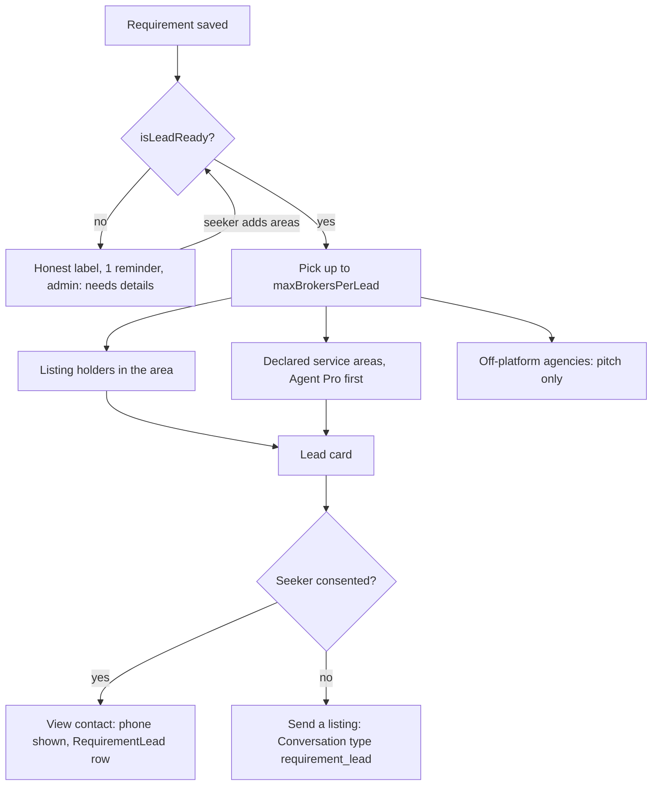

# Requirements as leads for brokers and agents

**Status: plan only (written 2026-09-28).** Builds on
[property-requirements-demand-side.md](property-requirements-demand-side.md) (capture, consent,
expiry, `RequirementMatchJob`) and
[requirement-refinement-questions.md](requirement-refinement-questions.md) (areas, BHK, budget and
must-haves asked after "Yes, find this for me"). Read those first.

## Why

A refined requirement, such as *"2 BHK semi-furnished house for rent in Whitefield or Marathahalli,
Bengaluru · ₹25k–35k/month · within a month · verified phone"*, is exactly what a local broker or
agent wants: a real person, a named need, a budget and a deadline, in the areas they work. The site
has the demand at the moment of a failed search, but not the inventory (320 active listings, about
six repeat owners). Routing that demand to the people who *do* have inventory, on or off the
platform, is how a seeker gets an answer and how supply gets a reason to join.

## Decisions (2026-09-28)

1. **Contact: the phone number is shown with consent, and it's message-only without consent.**
   - Seeker consented (`Requirement.contactConsentAt` set): a matched broker who opens the lead sees
     the seeker's phone.
   - Seeker did not consent: the broker can only send a listing into the seeker's Bhavano inbox.
   - This **supersedes, for consenting seekers**, the parent plan's 2026-09-17 decision to "reveal
     the phone only when the seeker replies". The capture checkbox already reads *"Owners and agents
     with a matching property may call or message me"*, so what a seeker agrees to doesn't change.
     What changes is that the platform now acts on it. The copy gains the cap (below).
2. **Three audiences receive leads:**
   - people with active listings in the area and category;
   - agents who declare service areas;
   - off-platform agencies already collected for the area from Google Places.
3. **Free at launch, credits later.** An admin-tunable monthly allowance, then credit packs using
   the pattern `ContactRevealSetting` / `ContactRevealCreditBatch` already established. One charge
   per lead per broker, never per attempt.

## When a requirement becomes a lead

A requirement is sent to brokers only when it is **complete** (lead-ready). All four of these are
required; without any one of them it is vague:

1. **a city** (`cityId`; a capture can no longer be saved without one),
2. **1 to 5 areas** in `areaIds`,
3. **what they want to do**: buy, rent or lease (`transactionType`; PG, furniture and interiors
   each imply one),
4. **the property type** (`category`: house, apartment, plot…; PG, furniture and interiors are
   their own),

and `status = open`, not expired. Budget and size make a lead better but are not required
(changed 2026-09-28; it used to be area plus a budget or size).

`isLeadReady` is computed, not stored. It lives in `packages/types` so the BFF, the admin queue and
both apps agree on it.

A capture like *"Rent 2 BHK Houses in Bengaluru"* with no area is **not** a lead. Sent as-is, it
would reach every agent in a 700 km² city, which is spam to them and a flood of calls for the
seeker. It is handled by the refinement doc's generic-capture policy instead:
- the label is honest about what's missing;
- the seeker gets one reminder to finish;
- the admin queue shows a "needs details" badge.

It becomes a lead the moment the seeker names an area.



## Audiences and ranking

### 1. Listing holders in the area (inventory match)

Extends today's `listMatchingOwnerInventory` / `RequirementMatchJob`:
- same city, category and transaction type;
- the listing's area is in the requirement's `areaIds`.

Ranked:
1. An active listing that also fits the BHK set and budget.
2. Same area and category, but outside the budget or BHK.
3. Inventory in the last N months but nothing active now.

This is the highest-value audience because they can answer with a specific property today.

### 2. Agents who declare service areas

New `AgentServiceArea` rows (userId, cityId, areaId, category), set from the account profile ("Areas
I cover"). Capped per user (say 15 area × category pairs) so nobody claims all of Bengaluru. Agent
Pro subscribers (`User.agentProUntil` in the future) rank ahead of free accounts. This finally gives
Agent Pro the concrete benefit the parent plan's monetization section wanted for it.

A declared agent with no listing that fits is prompted to **post the matching property** when they
open the lead, which converts demand into inventory.

### 3. Off-platform agencies (outreach)

`OutreachContact` rows with a real-estate `businessCategory` and the requirement's `areaId`,
already scraped per area by the Places lead-gen. They get a **pitch, not a lead**: *"3 people are
looking for a 2 BHK in Whitefield this week. Join Bhavano free to respond."*
- No seeker details of any kind.
- Batched per agency per week.
- Goes through the existing outreach send path, with its suppression, opt-out and
  `businessStatus = OPERATIONAL` rules.

Once the agency signs up and declares its areas, it is audience 2. This is the parent plan's
"targeted owner recruitment" loop, fed by requirements.

## Fan-out rules

The per-lead cap is what makes a shared phone number acceptable.

- **At most `maxBrokersPerLead` (default 5) brokers ever get contact access to one requirement.**
  Notification may go to a few more, but contact access is first come, first served until the cap
  is reached. After that the lead card shows "This lead has been taken".
- **`dailyLeadsPerBroker`** caps how many leads one account can open per day, even when paid.
  The parent plan's warning stands: per-lead revenue pushes the platform toward maximising reveals,
  so this is a deliberate policy number.
- One lead digest per broker per day, like `RequirementMatchJob` today. No per-event blasts.
- Only accounts with a **verified phone** can open leads.

## The lead card

Shown on web `/requirements/matching` (extended from owner inventory to all three audiences), on the
matching mobile screen, and summarised in the daily digest.

- **Before opening:** the refined label (`formatRequirementLabel`), move-in date, "verified phone",
  consent state ("open to calls" / "messages only"), how many brokers have already responded ("2 of
  5 spots taken"), and the broker's own listings that fit, pre-selected. No seeker name or phone.
- **Open, with consent:** "View contact" writes the `RequirementLead` row and shows the phone.
  Whether the name is shown too is an open decision.
- **Open, without consent:** "Send a listing" creates a `Conversation` on the broker's listing, with
  `posterId` = broker, `inquirerId` = seeker, and new `ConversationType` value `requirement_lead`.
  The existing inbox, unread counts and push then work unchanged. `@@unique([listingId,
  inquirerId, type])` already stops the same listing being sent twice.

## Seeker side

- **Consent copy** at capture: *"Up to 5 verified agents with matching homes in {areas} may call or
  message me."* The done state and the confirmation message repeat it, with the real area names.
- **`/my-requirements`** shows who has the number: "3 agents have your number", each with name,
  agency, when they opened it, and **Report**.
- **Withdraw consent** from `/my-requirements`. It stops new contact reveals immediately, and says
  plainly that numbers already shared can't be un-shared.
- Closing ("I found something" / "no longer looking") or expiry hides the lead from every broker
  and stops new access.
- **Report** on the lead and on the thread. Repeated reports against a broker suspend their lead
  access pending admin review (`RequirementLeadSetting.reportsToSuspend`).

## Data model

```prisma
/** One row per (requirement, broker) contact access: the audit trail, the future paid unit, and the
 * start of the broker CRM. */
model RequirementLead {
  id                String    @id @default(cuid())
  requirementId     String
  brokerUserId      String
  source            String    // inventory | service_area
  notifiedAt        DateTime?
  viewedAt          DateTime?
  contactRevealedAt DateTime? // null for message-only leads
  conversationId    String?   // set when a listing was sent
  creditBatchId     String?   // null while leads are free
  outcome           String?   // contacted | shortlisted | closed | reported
  createdAt         DateTime  @default(now())

  @@unique([requirementId, brokerUserId])
  @@index([brokerUserId, createdAt])
}

model AgentServiceArea {
  id       String          @id @default(cuid())
  userId   String
  cityId   String
  areaId   String
  category ListingCategory
  @@unique([userId, areaId, category])
  @@index([areaId, category])
}

/** Singleton, same convention as ContactRevealSetting. */
model RequirementLeadSetting {
  id                   String @id
  maxBrokersPerLead    Int    @default(5)
  dailyLeadsPerBroker  Int    @default(10)
  freeLeadsPerMonth    Int    @default(20)
  reportsToSuspend     Int    @default(3)
  // credit pack fields added when pricing lands
}
```

`ConversationType` gains `requirement_lead`. `Requirement` needs no new column for this. Consent
is `contactConsentAt`, and withdrawing sets it back to null.

## API sketch

- `GET /requirements/leads`: lead cards for the signed-in broker, from all audiences, ranked, with
  "spots taken" counts.
- `POST /requirements/:id/leads/reveal`: consent required, and cap, daily limit, verified phone and
  allowance are checked in one transaction so two brokers racing for the fifth spot can't both win.
  Writes `RequirementLead` and returns the phone.
- `POST /requirements/:id/leads/send-listing` `{ listingId }`: the listing must belong to the caller
  and fit the category. Creates the conversation and first message, and upserts `RequirementLead`.
- `GET/PUT /me/service-areas`.
- Seeker: `GET /requirements/mine/:id/leads` (who has my number), `POST
  /requirements/mine/:id/withdraw-consent`, `POST /requirements/leads/:leadId/report`.

## Phases

1. **Lead-ready gate plus listing holders, on web.** Extend the owner match to `areaIds` and ranking,
   the lead card, reveal and send-listing, `RequirementLead`, caps, the seeker's "who has my number",
   withdraw and report. Free for everyone.
2. **Service areas and Agent Pro priority.**
3. **Outreach pitch** to off-platform agencies.
4. **Mobile** lead cards and the seeker's lead list.
5. **Credits and pricing**, once there is volume to price against.

## Measurement

- Leads sent / opened / contacted, per audience. Is the listing-holder audience alone enough?
- Seeker outcome: share of lead-ready requirements closed as "I found something" within 30 days,
  vs non-lead-ready ones.
- Report rate per 100 reveals. The launch guardrail: if it rises, lower `maxBrokersPerLead` before
  anything else.
- Outreach: pitch → signup → first lead opened.

## Open decisions

1. **Is 5 brokers per lead right?** Fewer makes each lead more valuable and safer. More gets the
   seeker more options.
2. **Name, or only the phone?** Showing the seeker's name helps the call. Leaving it out limits what
   an unwanted caller knows.
3. **Must a broker attach a listing even when the phone is shown?** It forces a concrete offer and
   records what was pitched, but slows agents who work off-platform inventory.
4. **Verifying agents**: a verified phone only at launch, or a RERA number for the "verified agent"
   label that ranks higher?
