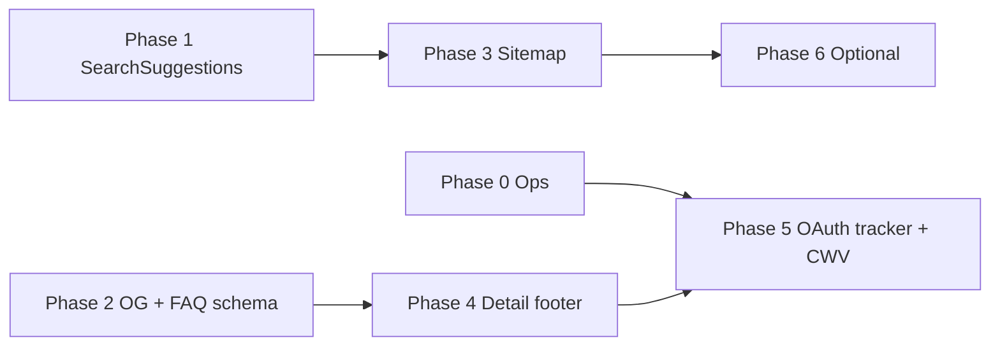

# SEO remaining improvements — implementation plan

## Context

[`seo-google-ads-readiness.md`](./seo-google-ads-readiness.md), [`seo-distinct-window-pagination.md`](./seo-distinct-window-pagination.md), and [`seo-all-cities-footer-links.md`](./seo-all-cities-footer-links.md) already shipped the structural SEO backbone (URLs, metadata, JSON-LD on listings, sitemap/robots, footer city/area links, pagination, GTM hooks).

This plan covers the **gaps called out in review** afterward: crawlable discovery links above the fold, richer metadata/schema, sitemap completeness, listing-detail internal linking, Google OAuth signup tracking, production verification, and a CWV follow-up loop.

**Out of scope here** (unless explicitly pulled in later):

- Per-city `fetchPopularSearches(cityId)` ranking (BFF already accepts `cityId`; UI already passes it — no change needed for that).
- Splitting `sitemap.xml` into a sitemap index (only needed once listing count reliably exceeds the BFF’s `take: 5000` cap in `findAllForSitemap()`).
- Rewriting browse meta copy for every city×category combination (Phase 6 — optional polish).

---

## Phase 0 — Production ops (no app code)

These unblock measurement; [`deployment.md`](../deployment.md) already documents the steps.

| Task | Owner | Done when |
|------|--------|-----------|
| Add Search Console **domain** property; DNS TXT `google-site-verification=…` in Cloudflare | Infra | Property shows “Verified” |
| Set `NEXT_PUBLIC_GTM_ID` on prod `web` service | Infra | GTM preview shows container on homepage |
| In GTM: GA4 config tag + Ads conversion tags on existing `dataLayer` events (`contact_owner`, `post_ad_success`, `boost_purchase`, `subscription_purchase`, `begin_checkout_*`, `save_search`, `signup_complete`) | Growth | Test events in GA4 DebugView |
| Rich Results Test on one listing URL + one browse URL | Eng | No errors on BreadcrumbList / Product |
| PageSpeed Insights on home, browse, listing detail | Eng | Baseline scores recorded; issues filed for Phase 5 |

---

## Phase 1 — Crawlable `SearchSuggestions` (highest code impact)

**Goal:** Always-rendered, server HTML links for popular intents — not hidden behind the client `SearchBar` dropdown.

**Prior art:** [`seo-footer-city-area-links-and-search-suggestions.md`](./seo-footer-city-area-links-and-search-suggestions.md) (part 1 footer work is **already done** via [`seo-all-cities-footer-links.md`](./seo-all-cities-footer-links.md); only part 2 remains).

### 1.1 New component

**File:** `apps/web/src/components/home/SearchSuggestions.tsx` (async server component)

Props:

- `cityName: string` — scopes “Try searching” links.
- `popularSearches: PopularSearchDto[]` — same shape as `Header` / `resolvePopularSearches()` (caller fetches; no duplicate fetch inside the component).

Sections (both use real `<Link href={buildBrowsePath(...)}>`):

1. **Popular searches** — map `popularSearches` like `SearchBar` does today (category + transaction group + city).
2. **Try searching** — 4–6 stable examples per city, reusing conventions from `homeCategories.ts` / `MegaMenu` (e.g. 2 BHK apartments buy, PG rent, coworking rent, furniture). Implement via a small exported helper in `homeCategories.ts` (e.g. `trySearchingLinks(cityName): { label, href }[]`) so mega menu and suggestions never diverge.

**UX:** Compact row of chips under the header search bar; match existing chip styles from `SearchBar` (border, rounded pill) but as links. Optional: visually de-emphasize vs. the main H1 (smaller label “Popular searches” / “Try searching”).

**Leave unchanged:** `SearchBar` focus dropdown (typing aid + duplicate chips as buttons is fine).

### 1.2 Wire call sites

| File | Change |
|------|--------|
| `apps/web/src/app/page.tsx` | After `<Header />`, before `<main>` (or as first child of `<main>`): `<SearchSuggestions cityName={cityName} popularSearches={popularSearches} />` |
| `apps/web/src/components/home/BrowseListingsView.tsx` | Same placement; `cityName` and `popularSearches` already in scope |
| `ListingDetailView.tsx` | **Do not** add (mid-funnel page; keep focus on listing + breadcrumbs) |

### 1.3 Verification

- View source on `/` and `/bengaluru/buy/apartment` without focusing the search input: anchor `href`s present for both sections.
- `pnpm -w typecheck`

---

## Phase 2 — Default Open Graph image + Help FAQ schema (quick wins)

### 2.1 Sitewide default `og:image`

**Problem:** Browse/home/static pages inherit OG title/description but no image; social previews look broken.

**Approach:**

1. Add a branded share image under `apps/web/public/og-default.png` (recommended **1200×630**, &lt; 300 KB). Reuse logo + tagline; design can mirror marketing.
2. In `apps/web/src/app/layout.tsx` `metadata.openGraph.images` and `metadata.twitter.images` (or `twitter` card fields per Next Metadata API), point at `/og-default.png` (absolute URL resolved via existing `metadataBase`).

Listing detail keeps overriding with `listing.photosFull[0]` in `generateMetadata` — no change there.

### 2.2 `FAQPage` JSON-LD on `/help`

**File:** `apps/web/src/app/help/page.tsx`

- Extract plain-text answers for schema only (React nodes in FAQ answers stay for UI). Pattern: parallel `FaqPlain[]` with `q` + `a: string`, or a `faqPlainText(q, a)` map alongside existing groups.
- Render `<JsonLd data={{ "@context": "https://schema.org", "@type": "FAQPage", mainEntity: [...] }} />` once at page level (same `JsonLd` component as layout).
- Keep visible `
` UI unchanged.

### 2.3 Verification

- Share debugger / manual check: homepage `og:image` resolves to `…/og-default.png`.
- Rich Results Test on `/help` → FAQ detected (if eligible).

---

## Phase 3 — Sitemap completeness

**File:** `apps/web/src/app/sitemap.ts`

### 3.1 Static routes

Append fixed entries (no `lastModified` required, or use repo deploy date):

- `/help`, `/terms`, `/privacy`, `/contact`

### 3.2 All curated cities (and areas)

Today browse URLs are derived **only from listings**, so empty cities never appear.

- `fetchCities(undefined, true)` in `sitemap()` (same as footer).
- For each city: `buildBrowsePath({ cityName })`.
- For each city, `fetchAreas(city.id, undefined, true)` (batch reasonably — 37 cities × 1 request is acceptable at build/request time; if slow, add a single BFF “all areas for sitemap” endpoint in a follow-up).

Cap area URLs per city with the same `MAX_FOOTER_AREAS` constant as footer (24) **or** import shared constant from a tiny `apps/web/src/lib/seoConstants.ts` to avoid drift.

### 3.3 Facet landing URLs (from inventory)

When iterating listings (existing loop), also collect distinct paths that include a facet when the listing implies one:

- Apartment/house: derive bedroom facet from listing specs/DTO if available on `ListingSitemapEntry`; if not on DTO today, extend `ListingSitemapEntry` + BFF `findAllForSitemap()` select (e.g. `bedrooms` or parsed from specs) — **minimal BFF change**, only if web cannot infer facet from current sitemap payload.
- PG / furniture / etc.: use `facetKindForCategory` + listing fields already on the card DTO.

Add paths via `buildBrowsePath({ cityName, transactionGroup, category, facetValue, areaName? })` at depths that match real browse pages (at minimum: city+group+category+facet; optionally city+area+group+category when area is known).

**Guardrail:** Deduplicate with `Map`/`Set` like existing city/group/category keys — do not emit combinatorial explosions.

### 3.4 Verification

- Hit `/sitemap.xml` locally: static URLs present; a city with zero listings still has a city-root URL if it exists in `fetchCities`.
- Confirm URL count stays reasonable (&lt; 50k).

---

## Phase 4 — Listing detail internal linking

**Goal:** Detail pages are high-value URLs but currently end without `Footer` — weak cross-links to hubs.

**Files:**

- `apps/web/src/components/home/ListingDetailView.tsx` — wrap or extend layout: after main content column, render `<Footer currentCityName={listing.cityName} cityAreas={…} allCities={…} />`.
- `apps/web/src/app/[city]/[[...rest]]/page.tsx` — already fetches `allCitiesForDetail`; also `fetchAreas(cityRow.id, undefined, true)` for the listing’s city and pass into `ListingDetailView` as new optional props.

**Optional enhancement (same PR or follow-up):** Replace generic “← Back to listings” with a text link to the listing’s natural browse parent (`buildBrowsePath` from listing fields: city, area, group, category).

### Verification

- Listing detail HTML includes footer city/area links.
- No layout regression on mobile (footer below long content).

---

## Phase 5 — Google OAuth `signup_complete` + CWV loop

### 5.1 `signup_complete` for Google sign-in

**Problem:** Phone OTP fires in `AuthGateProvider` after `verifyOtpAction`; Google uses `signIn("google")` redirect — client code after `signInWithGoogleAction()` never runs.

**Approach (session-based one-shot tracker):**

1. New client component `apps/web/src/components/home/SignupCompleteTracker.tsx`:
   - Uses `useSession()` from `next-auth/react` (ensure `SessionProvider` wraps app — add in `layout.tsx` if missing).
   - On mount, if `session?.isNewUser === true`, call `pushDataLayerEvent("signup_complete", { method: "google" })` (or `method` from session if unified).
   - Guard with `sessionStorage` key `bhavano.signupCompleteFired` so repeat navigations in the same browser session don’t duplicate (JWT `isNewUser` persists for the whole session per `auth.ts` comment).
2. Mount `<SignupCompleteTracker />` once inside `AuthGateProvider` or root layout body.

**Note:** Phone OTP can optionally move to the same tracker later for one code path; not required if phone path already works.

### 5.2 Core Web Vitals (measurement-driven)

After Phase 0 PSI baseline:

| Issue type | Typical fix in this repo |
|------------|---------------------------|
| LCP | Hero `priority` already on listing image; check static map image (`ListingDetailView`) — consider `next/image` + explicit dimensions or lazy-load below fold |
| CLS | Ensure all `Image`/`fill` parents have fixed aspect ratio |
| INP | Defer non-critical client work in `Header` / `SearchBar`; audit GTM tags added in dashboard |
| Logo | `Header.tsx`: set meaningful `alt` on logo (`alt="Bhavano"`) — tiny accessibility + SEO nicety |

File issues from PSI; only implement fixes that show up on **production** URLs.

---

## Phase 6 — Optional enhancements (lower priority)

Implement after Phases 1–5 unless product asks sooner.

### 6.1 `ItemList` JSON-LD on browse pages

In `[city]/[[...rest]]/page.tsx` browse branch (not listing detail): emit `ItemList` with `itemListElement` pointing at top N listing URLs from the current page’s `fetchListings` result (name = title, url = absolute `buildListingPath`). Cap at 12 to match page size.

### 6.2 `WebSite` + `SearchAction` on homepage

In `page.tsx` or layout (homepage-only via a small server wrapper): JSON-LD with `potentialAction` targeting site search. **Caveat:** site search is mostly rule-based + homepage `?q=` — only add `SearchAction` if the `target` URL template matches what search actually does, or Google may ignore it.

### 6.3 Richer browse `description` in `generateMetadata`

Replace `Browse ${heading.toLowerCase()} on Bhavano.` with 1–2 sentences that include city, category, and transaction type (template-based, no CMS). Keeps implementation deterministic.

---

## Suggested implementation order

**Recommended PR split** (reviewable units):

1. PR A: Phase 1 (`SearchSuggestions` + `homeCategories` helper)
2. PR B: Phase 2 (OG image asset + layout metadata + Help FAQ JSON-LD)
3. PR C: Phase 3 (sitemap; may include small BFF sitemap DTO tweak for facets)
4. PR D: Phase 4 (listing footer + optional breadcrumb link)
5. PR E: Phase 5 (`SignupCompleteTracker`, `SessionProvider`, logo alt, any PSI fixes)
6. PR F: Phase 6 (optional schema/copy)

Phase 0 can run in parallel with PR A.

---

## Global verification checklist

- [ ] `pnpm -w typecheck`
- [ ] Homepage + browse: view-source shows `SearchSuggestions` links without JS
- [ ] `/sitemap.xml`: static + all cities + facets deduped
- [ ] Listing detail: footer links + canonical/OG unchanged
- [ ] New Google account: one `signup_complete` in GTM dataLayer (sessionStorage guard)
- [ ] Rich Results: listing + help FAQ
- [ ] PSI: record before/after for three URL types

---

## Files touched (summary)

| Phase | Primary files |
|-------|----------------|
| 1 | `SearchSuggestions.tsx` (new), `homeCategories.ts`, `page.tsx`, `BrowseListingsView.tsx` |
| 2 | `public/og-default.png` (new), `layout.tsx`, `help/page.tsx` |
| 3 | `sitemap.ts`, possibly `packages/types` + `listings.service.ts` for facet on sitemap DTO |
| 4 | `ListingDetailView.tsx`, `[city]/[[...rest]]/page.tsx` |
| 5 | `SignupCompleteTracker.tsx` (new), `layout.tsx` or `AuthGateProvider.tsx`, `Header.tsx` |
| 6 | `[city]/[[...rest]]/page.tsx`, `page.tsx` |
